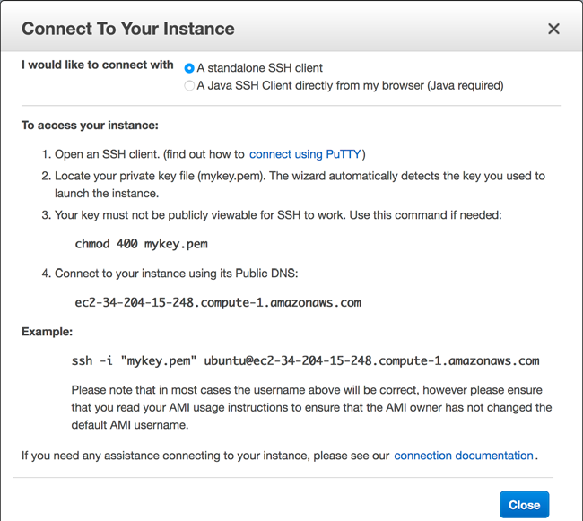
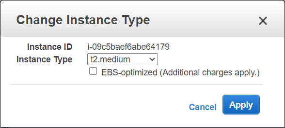

# VM

- VM is part of a physical machine isolated from other VM's on the same physical machine.
- VM consists of OS, CPU, memory,networking, interfaces, storage.
- The physical machine is called host, and the VM's running on it are called guests.
- Hypervisor is responsible for isolating guests from each other and for providing virtual hardware plaform.
- Typical use cases of VM
  - Hosting a web application such as wordpress.
  - Running an enterprise application such as ERP.
  - Transforming and alalyzing data such as encoding vidoe files.
- To launch a VM in AWS go to AWS management console -> EC2 Dashboard -> Launch Instance.
- Launching a VM in AWS consists of the following steps.
  - Selecting an OS
  - Choosing the size of virtual machine
  - Configuring details
  - Adding storage
  - Tagging virtual machine
  - Configuring a firewall
  - Reviewing input and selecting a key pair used for SSH authentication
- Selecting an OS
  - In AWS, OS comes bundled with preinstalled software for VM's; this bundle is called Amazon Machine Image(AMI).
  - The AMI is a special type of virtual appliance for use with the EC2 service.
  - An AMI technically consists of a read-only filesystem including the OS, additional software, and configuration; 
  - AMI doesn’t include the kernel of the OS. The kernel is loaded from an Amazon Kernel Image (AKI).
  - AMIs are offered by AWS, thirdparty providers, and by the community.
  - AWS offers the Amazon Linux AMI, which is based on Red Hat Enterprise Linux and optimized for use with EC2.
  - AWS marketspace provides other popular Linux distributions and AMIs with Microsoft Windows Server as well.
  - AWS marketspace provides more AMIs with preinstalled third-party software. It’s important to choose AMI's with trusted publisher.

	
  
- Choosing the size of virtual machine
  - In AWS computing power is classified into instance types.
  - Instance types are optimized for different kinds of use cases.
    - T family -> Cheap, moderate baseline performance with the ability to burst to higher performance for short periods of time
	- M family -> General purpose, with a balanced compute, memory, and network resources suitable for many applications.
	- C family -> Compute Optimized instances ideal for compute-intensive workloads that benefit from high performance processors.
	- R family -> Memory optimized instances are designed to deliver fast performance for workloads that process large data sets in memory.
	- D family -> Storage optimized, offering huge HDD capacity.
	- I family -> Storage optimized, offering huge SSD capacity.
	- X family -> Extensive capacity with a focus on memory, up to 1952 GB memory and 128 virtual cores.
	- F family -> Accelerated computing based on FPGAs (field programmable gate arrays).
    - P, G, and CG family -> Accelerated computing instances use hardware accelerators, or co-processors, to perform functions, such as floating point number calculations, graphics processing, or data pattern matching, more efficiently than is possible in software running on CPUs.
  - Instance types and families
    - The names for different instance types are all structured in the same way.
    - AWS releases new instance types and families from time to time; the different versions are called generations.
    - The instance size defines the capacity of CPU, memory, storage, and networking.
	- The instance type t2.micro represents instance family `t`, generation `2` and instance size `micro`.
  
	
  
- Configuring details
  - Configure details has customized options to suit various needs like below.
    - No of instances
	- Network settings(VPC, subnets, publicIP)
	- Shutdown(stop/terminate)
	- Monitoring(cloudwatch)
	- Tenancy(Shared/Dedicated)
	- IAM role(Access control for machine accessing other AWS services)

	

- Adding storage
  - AWS provides network-attached storage to virtual machine.
  
  
  
- Tagging virtual machine
  - Tags help organize resources on AWS. Tag is a key-value pair.
  - Organizing resources with tags has the following major use cases.
    - Use tags to filter and search for resources.
	- Analyze your AWS bill based on resource tags.
	- Restrict access to resources based on tags.
	
	
	
- Configuring a firewall
  - A firewall helps to secure virtual machine.
  - AWS Security group is a set of firewall rules that control traffic to instances.
  
  
  
- Reviewing input and selecting a key pair used for SSH authentication
  - Logging into VM requires key.
  - AWS provides option to choose an existing Key Pair or creating a new key pair.
  
  
  
- Connecting to VM
  - Installing additional software and running commands on VM can be done by connecting remotely.
  - To view the VM on AWS management console, Click the EC2 service in the navigation bar under Services, and click Instances in the submenu at left.
  - Clicking `connect` on instances page shows instructions for connecting VM as shown below.
  - User name for connecting VM differs from one OS to another. For ex, for ubuntu  username is `ubuntu`, for redhat it is `ec2-user`.
  
  
  
- Monitoring and debugging VM
  - AWS allows you to see the EC2 instance’s logs with the help of the Management Console.
  - View the instance logs, click on `Get System Log` as shown below.
  - If an error message appears and the error message is not obvious, contact the vendor of the AMI, AWS Support, or post question in the AWS Developer
Forums at https://forums.aws.amazon.com.

  
  
- Monitoring the load of a virtual machine  
  - As shown in the above image, the monitoring panel below the instances displays metrics for CPU, network, and disk usage.
  - Metrics are updated every 5 minutes with basic monitoring. If enable detailed monitoring metrics are updated every minute, but it costs extra.
  
- Shutting down a virtual machine
  - To change the state of an instance on Management console, EC2 Dashboard -> Instances -> Actions -> Instance State
  - The following four actions possible to control state of a VM. 
    - Start -> A stopped VM can always be started. Starting a stopped VM may likely run on a different host. 
    - Stop -> A running VM can be stopped. A stopped virtual machine doesn't cost anything, but if it has a network attached storage it costs money.	
	- Reboot -> If a VM needs to be turned off and on again, this is the right option. No persistent data is lost because it runs on the same host.
	- Terminate -> Terminating a VM deletes VM, usually together with dependencies like network-attached storage and public and private IP addresses.
	
	
	
- Changing the size(or intance type) of a virtual machine
  - AWS EC2 has the flexibility to scale vertically. If more computing power is needed, increase the size of EC2 instance.
  - Changing instance type, may likely changes the physical host and private/public IP of VM.
  - Running VM should be stopped before changing instance type. To stop VM, EC2 Dashboard -> Instances -> Actions -> Instance State -> Stop.
  - To change the instance type EC2 Dashboard -> Instances -> Actions -> Instance Settings -> Chane Instance Type.
  - After changing instance type, start the instance again.
  - To view the memory and CPU information before and after changing, use the commands `cat /proc/cpuinfo` and `free -m`.
  
	

- Regions, Availability Zones, Local Zones
  - AWS infrastructure is divided into Regions, Availability zones, Local zones.
    - Region: Each Region is a separate geographic area.
	- Availability Zone(AZ): Each Region has multiple, isolated locations known as Availability Zones.
	- Local Zone: Local Zones provide you the ability to place resources, such as compute and storage, in multiple locations(AZ) closer to your end users.  Local Zone is a logical concept to create a zone using one or more availability zones.
  - Following criteria needs to be taken into account when deciding which region to choose for cloud infrastructure.
    - Latency -> Which region offers the shortest distance between users of application and infrastructure.
	- Compliance -> Verify if the application is allowed to store and process data in the region chosen for infrastructure.
	- Service availability -> AWS does not offer all services in all regions. Checkout the service availability for different regions with the region table at https://aws.amazon.com/about-aws/global-infrastructure/regional-product-services/.
	- Costs -> Service costs vary by region. Choosing the cost effective region is very important.

- Starting webserver in a VM in another data center
  - To change a regions from AWS management console, choose region from top right corner as shown below.
	
	

  - No data is transferred between regions. So, creating VM needs to create new key-pair, firewall rules etc.
  - Let's choose Amazon Linux AMI.
  - To allow http web traffic at port 80, additional firewall rule needs to be created when configuring security group.
  
	
  
  - To start apache http server, login to VM, install http and run it using the below commands.
    - `sudo yum install httpd -y`
	- `sudo service httpd start`
  - Get publicIp address from Aws management console(Description) and access the ip from browser (http://publicIP).
  
- Allociating a public IP address
  - AWS allocates a public IP address to a VM automatically. But, everytime a VM stopped and launched again a new public IP is assigned.
  - If an application needs a fixed public IP, AWS offers a service called Elastic IPs.
  - Creating a public IP address 
    - AWS Management console -> EC2 Dashboard -> Network and Security -> Elastic IPs -> Allocate new address.
  - Associating the public IP address with VM
    - Select public IP address, and choose Associate Address from the Actions menu.
	- Select Instance as the Resource Type.
	- Enter your EC2 instance’s ID in the Instance field.(This is EC2 instance id).
	- Get private IP address of VM(This is EC2 instance's private IP, available at Description panel).
	- Click associate to finish.
    - Now appache webserver homepage(configured in the above section) is accessible at this public IP address.

	

- Adding an additional network interface to a virtual machine
  - It is possible to add multiple network interfaces to a VM and control the private and public IP addresses associated with those network interfaces.
  - Having multiple network interfaces have the following use cases.
    - web server needs to answer requests by using multiple TLS/SSL certificates and can't use Server name indication extension due to legacy clients.
	- Need to create a management network separated from the application network.
	- Application requires or recommends the use of multiple network interfaces for ex, network and security appliances.
  - Steps to create additional network interface.
    - AWS Management console -> EC2 service -> NETWORK & SECURITY -> Network interfaces.
	- The default network interface of your virtual machine is shown in the list. Keep a note of Subnet ID.
	- Click Create Network Interface.
	- Enter description, choose the subnet Id noted above.
	- Leave the private IP empty(A private IP will be assigned to the network interface automatically)
	- Select the Security Groups that were created during creation of VM and click create.
	
	
  
  -	Attach this network interface to VM from the Actions dropdown of network interfaces list page.
  
- Associate public IP to network interface.
  - Keep a note of network interface id from the above section.
  - Create a public IP using Elastic IP service.
  - While Associating public IP, choose Resource type `Network Interface`.
  - Enter the network interface id noted earlier.
  - Select the private IP of the network interface.
  - Click Associate.

- Configuring two websites using two network interfaces.
  - The command `ifconfig` displays both the private IP address details.
  - SSH to the EC2 instance and follow the below steps to create two websites.
  
		  sudo -s
		  mkdir /var/www/html/a
		  wget -P /var/www/html/a https://raw.githubusercontent.com/AWSinAction/code2/master/chapter03/a/index.html
		  
		  sudo -s
		  mkdir /var/www/html/b
		  wget -P /var/www/html/b https://raw.githubusercontent.com/AWSinAction/code2/master/chapter03/b/index.html
   
- Configure the web server to deliver the websites depending on which IP address is called.
  - Add two files a.conf, b.conf under `/etc/httpd/conf.d` directory.
  - Edit the files a.conf, b.conf and add the below content.
  - Replace 172.31.x.x with private IP's of the network cards.
  
	  `<VirtualHost 172.31.x.x:80>
		`DocumentRoot /var/www/html/a
	  `</VirtualHost>`
  
	  `<VirtualHost 172.31.x.x:80>
		`DocumentRoot /var/www/html/a
	  `</VirtualHost>
  
  - Run the command `sudo service httpd restart` to update the web server configuration.
  - When accessed the websites with two publicIP's browser should display `Hello A!` or `Hello B!`.
