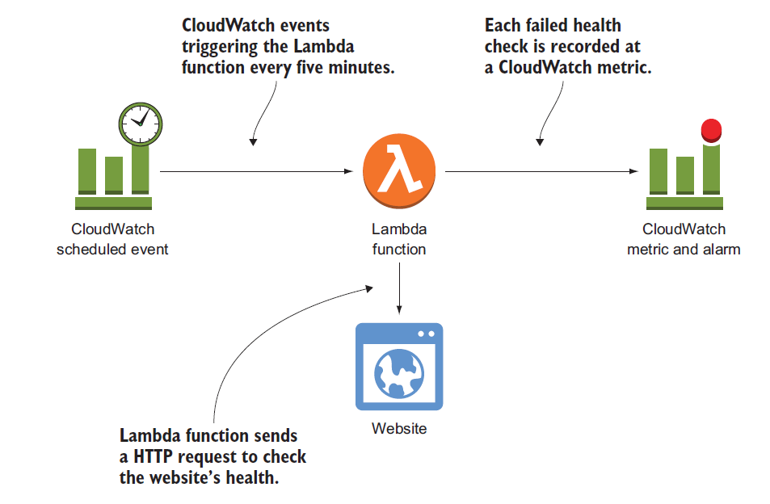
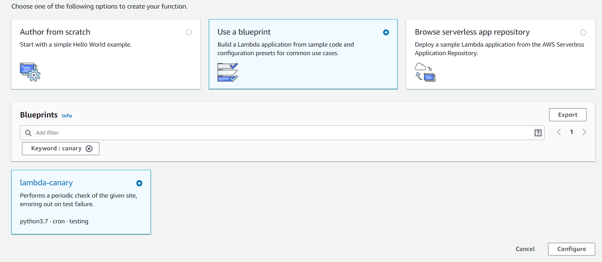
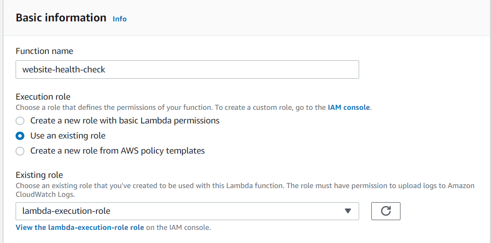
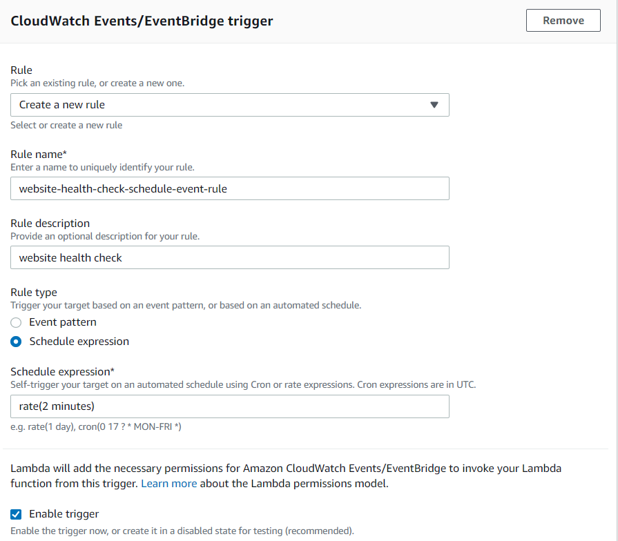
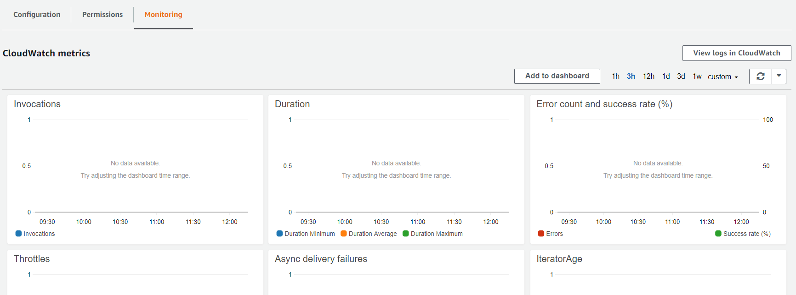
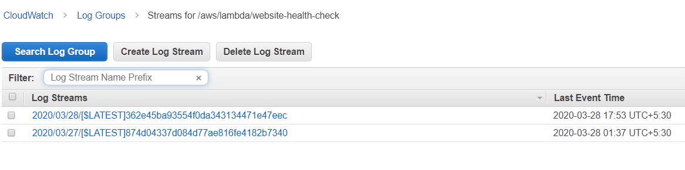
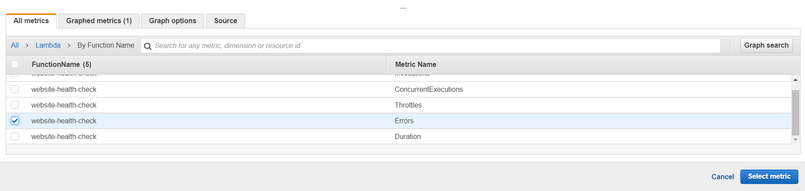
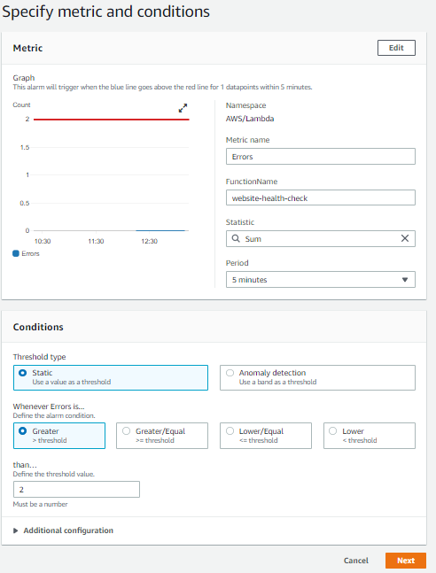

AWS Lambda
----------
You don’t need a virtual machine to run your own code anymore, as AWS Lambda offers execution environments for Java, Node.js, C#, Python, and Go. AWS Lambda is well-integrated with all parts of AWS, enabling you to easily automate operations tasks within your infrastructure.

AWS Lambda offers a maintenance-free and highly available computing environment. You no longer need to install security updates, replace failed virtual machines, or manage remote access (such as SSH or RDP) for administrators.

AWS Lambda is billed by invocation and duration of the execution.

Lambda functions publish metrics to CloudWatch by default. Cloud-Watch provides events that can be used to trigger Lambda functions as well.

Let's see an example for finding the health of an application. Let's schedule to publish an event every 5 minutes. This consists of 3 parts

1)Lambda function -> Executes a Python script that sends an HTTP request to your website (for example https://cloudonaut.io) and verifies that the response includes specific text (such as cloudonaut). 
2) Scheduled event -> Triggers the Lambda function every 5 minutes. This is comparable to the cron service on Linux.  
3) Alarm -> Monitors the number of failed health checks and notifies you via email whenever your website is unavailable.

Creating Lambda functions
-------------------------
We can create lambda from amazon console(https://console.aws.amazon.com/lambda/home).
Click on create function. It has 3 options.

1)Author from scratch -> start with a simple hello world example 
2)Use a blueprint -> Build a lambda function from sample code and configuration presets. 
3)Browser serverless app repository -> Deploys an application from aws serverless application repository.

Note:Using the Serverless Application Repository, you don't need to clone, build, package, or publish source code to AWS before deploying it. Instead, you can use pre-built applications from the Serverless Application Repository in your serverless architectures, helping you and your teams reduce duplicated work, ensure organizational best practices, and get to market faster.

In our example, we select option from blueprint, and search for canary. Select lambda-canary. lambda-canary performs a periodic health check to a given website and errors out in case of failure. It is written in python. 

In the next step of the wizard, you need to specify a name for your Lambda function. The function name needs to be unique within your AWS account as well as within the current region, and is limited to 64 characters.

If you need to invoke this lambda function via an api, you need to provide the function a unique name.

Creating or Selecting Role
--------------------------
Lambda function needs to have a role, if you want to write the lambda execution logs to cloudwatch. There are three options available.

1)Create a new role with basic Lambda permissions -> It creates a new role and gives a random name. 
2)Use an existing role -> you need to go to IAM screen and create a role and select it. 
3)Create a new role from AWS policy templates -> This options gives you a dropdown, you can select an option from the dropdown.

I have created a new IAM role with AWSLambdaBasicExecutionRole and named the role as lambda-execution-role.

Creating cloud watch event/trigger
----------------------------------
Creating a lambda function is fine, but to invoke that function as a scheduled event or to trigger based on an event, we need to create a cloud watch event/trigger.

Let's consider a scheduled event(for every 2 minutes) that will trigger your lambad health check.

To create a cloud watch event, we need to create a rule or select an existing rule. We have created a rule as shown below.

Selecting Rule Type
-------------------
There are two types of Rules. 
a)Event pattern -> This will trigger your lambda function based on an event pattern or an automated schedule. 
b)Schedule Expression -> Self-trigger your lambda fucntion based on an automated schedule using Cron or rate expressions.

Rate expression
---------------
For our example we can use 2 minutes schedule. The schedule expression is: 

		rate(2 minutes)

The schedule expression format is ($value $unit) where value is an interger and unit has the following values.

		minute,minutes, hour, hours, day, or days as the unit.

It's not possible to schedule lessthan a minute.

Note: Don't forget to enable the checkbox "Enable trigger".

Lambda function code
--------------------
The next section, shows a textarea with python code. This code is based on the blueprint selected.

Environment Variables
---------------------
Environment variables are commonly used to dynamically pass settings to your function.
The python code refers to two environment variables site and expected. Here is the sample code:

		import os
		from datetime import datetime
		from urllib.request import Request, urlopen

		SITE = os.environ['site']  # URL of the site to check, stored in the site environment variable
		EXPECTED = os.environ['expected']  # String expected to be on the page, stored in the expected environment variable

a)site ->Contains the URL of the website you want to monitor. Let's take the example website https://cloudonaut.io if you do not have any website of yours to monitor. 
b)expected ->Contains a text snippet that must be available on your website. If the
function doesn’t find this text, the health check fails. Use "cloudonaut" if you are
using https://cloudonaut.io as site.

The lambda function code, checks if the expected string is present in the given website(site) and prints "Check failed" if validation fails and then throws an exception. In case of success, it simply prints "Check passed!". Please see the below auto generated code.

Here is the sample lambda function code.

		def lambda_handler(event, context):
		print('Checking {} at {}...'.format(SITE, event['time']))
		try:
			req = Request(SITE, headers={'User-Agent': 'AWS Lambda'})
			if not validate(str(urlopen(req).read())):
				raise Exception('Validation failed')
		except:
			print('Check failed!')
			raise
		else:
			print('Check passed!')
			return event['time']
		finally:
			print('Check complete at {}'.format(str(datetime.now())))

		
		def validate(res):
		'''Return False to trigger the canary

		Currently this simply checks whether the EXPECTED string is present.
		However, you could modify this to perform any number of arbitrary
		checks on the contents of SITE.
		'''
		return EXPECTED in res

Note: You can read additional environment variables and can retrieve them in the code. For ex, if you want to read AWS_REGION to the code,

		import os
		region = os.environ['AWS_REGION']

If you want to see list of all available Runtime Environment variables, refer to the link: https://docs.aws.amazon.com/lambda/latest/dg/configuration-envvars.html

Monitoring through CloudWatch
-----------------------------
Open the Monitoring tab in the details view of your Lambda function. You will find
charts illustrating the number of times your function has been invoked, Duration of each invocation, Error count and success rate, Throttles, Concurrent executions etc as shown below.

To view logs, Click on "View logs in CloudWatch". It takes you to log groups as shown below.

Note:
By default, lambda function messages are send to a log group with default name as /aws/lambda/{lambda-fuction-name}. Typically, a log group contains multiple log streams, allowing the log group to scale.

Monitoring a Lambda function with CloudWatch metrics and alarms
---------------------------------------------------------------
A log message with the result of each health check is written to CloudWatch. The following metrics are published by each lambda function.

a)Invocations ->Counts the number of times a function is invoked. Includes successful and failed invocations.
b)Errors -> Counts the number of times a function failed due to errors inside the function. For example, exceptions or timeouts.
c)Duration -> Measures how long the code takes to run, from the time when the code starts executing to when it stops executing.
d)Throttles -> There is a limit for how many copies of your Lambda function are running at one time. This metric counts how many invocations have been throttled due to reaching this limit. Contact AWS support to increase the limit if needed.

Creating alarm has the following steps. 
a)Create an alaram 
b)Specify metrics 
c)Configuring actions 
d)Add name, Preview and Create

Creating an alarm
-----------------
Whenever the website health check fails, the Lambda function returns an error,
increasing the count of the Errors metric.

create an alarm notifying you via email whenever this metric counts more than 0 errors.

For creating alarm CloudWatch -> Alarms -> Create alarm -> Select metric -> Lambda -> By Function Name -> 

Specifying metrics and conditions
---------------------------------
You also need to define a name, a threshold, and the actions to be performed. For ex, If there are 2 errors in the last 5 minutes period, then send an alarm as shown below.

Configuring actions
-------------------
An action is something like sending an email notification. To configure an email notification, we should either create a new topic or use an existing topic. In our example, we create a new topic as shown below.

Add name
--------
Give a name to the alarm to uniquely identify the notification. The last step is to preview and create.

Accessing endpoints within a VPC
--------------------------------
Lambda functions are connected to the internet and therefore able to access other services. In our example, the Lambda function was sending HTTP requests over the internet.

If you want to run a health check for an internal website, then if you add network interfaces to your Lambda function, the function can access resources within your VPCs.

To do so you have to define the VPC, the subnets, as well as security groups for
your Lambda function. To do that, instructions are available at the below link.

https://docs.aws.amazon.com/lambda/latest/dg/configuration-vpc.html

Note: AWS recommends to not place lambda inside VPC, because lambda inside vpc increases complexity, especially when scaling to a large number of concurrent executions.For example, the number of available private IP addresses in a VPC is limited, but a Lambda function will need multiple private IP addresses to be able to scale the number of concurrent invocations.

