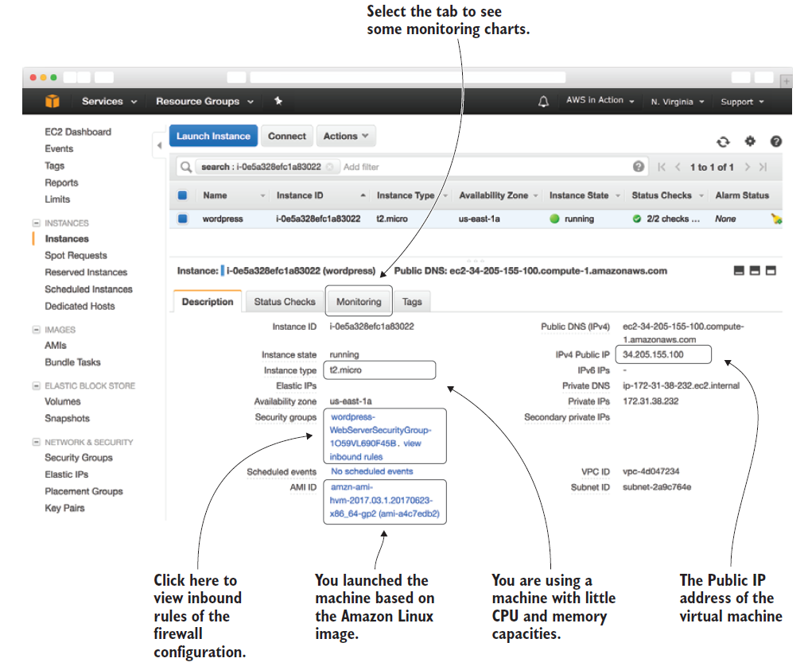
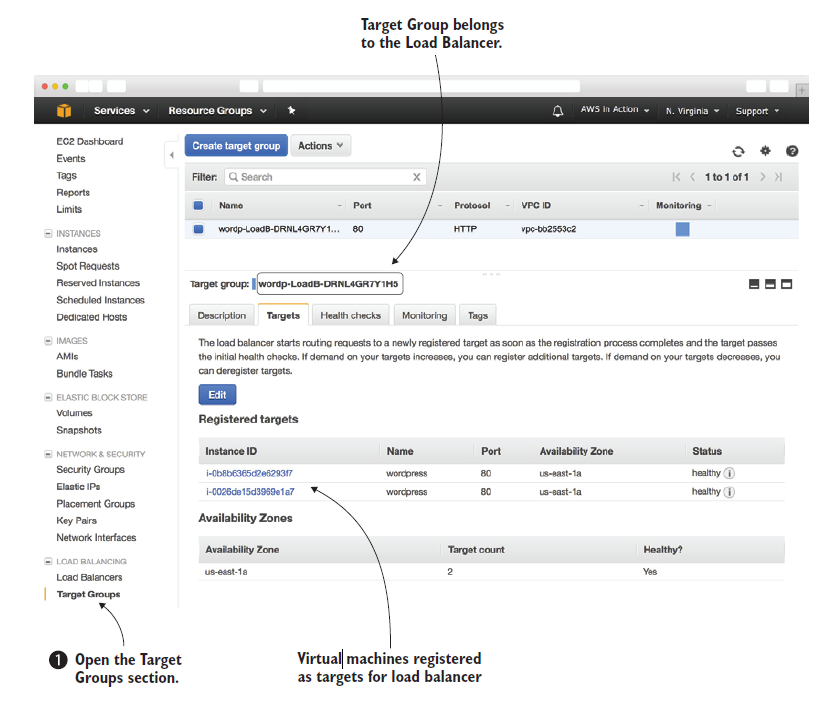
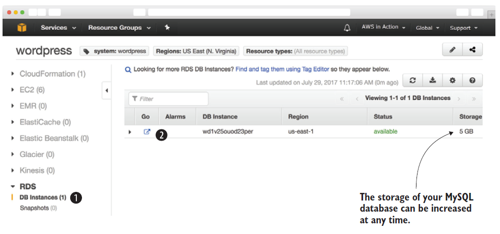

# AWS

- AWS is a platform of services. 
  - AWS provides a worldwide infrastructure for computing, networking, and storage capabilities.
  - An IaaS offering that provides virtual machines on-demand: Amazon EC2.
  - Highly distributed storage systems able to scale storage and I/O capacity without limits: Amazon S3
- Common problems such as load balancing, queuing, sending email, and storing files are solved for you by services.
- Picking the right service to build the complex system is key to get benefit out of AWS platform.
- AWS provides api, using which all tasks can be automated, like create networks, start virtual machine clusters, or deploy a relational database.
- Scalability is the key benefit of AWS. AWS can scale from one virtual machine to thousands of virtual machines, storage can grow from gigabytes to petabytes.
- Scalabiltiy is not just about adding, we can remove capacity based on the usage.
- Most of the AWS services are highly available or fault tolerant.
- Services are available on demand, meaning that if we need additonal VM's, AWS provides it in few minutes.
- Global infrastructure
  - AWS offers data centers in North America, South America, Europe, Asia, and Australia.
  - Global infrastructure offers low network latencies between customers and infrastructure, being able to comply with regional data protection requirements, and benefiting from different infrastructure prices in different regions.
- Pricing
  - To calculate monthly the monthly cost of a planned setup, use AWS simple monthly calculator at http://aws.amazon.com/calculator.
  - AWS services are billed in different ways.
    - Based on minutes or hours of usage—A virtual machine is billed per minute. A load balancer is billed per hour.
    - Based on traffic—Traffic is measured in gigabytes or in number of requests, for example.
    - Based on storage usage—Usage can be measured by capacity (for example, 50 GB volume no matter how much you use) or real usage (such as 2.3 GB used).
- Managing servies
  - AWS services can be managed by sending requests to the API manually via web ui called management console, a CLI or programatically via an SDK.
  - VM's can be connected through SSH and can be installed softwares on them.
  - AWS offers lot of services. Some important services are
    - EC2—Virtual machines
    - ELB—Load balancers
    - Lambda—Executing functions
    - Elastic Beanstalk—Deploying web applications
    - S3—Object store
    - EFS—Network filesystem
    - Glacier—Archiving data
    - RDS—SQL databases
    - DynamoDB—NoSQL database
    - ElastiCache—In-memory key-value store
    - VPC—Private network
    - CloudWatch—Monitoring and logging
    - CloudFormation—Automating your infrastructure
    - OpsWorks—Deploying web applications
    - IAM—Restricting access to your cloud resources
    - Simple Queue Service—Distributed queues
- Interacting with AWS
  - Management console
    - Management console helps you to gain an overview of the different services quickly. 
    - Management Console is also a good way to set up a cloud infrastructure for development and testing.
  - CLI
    - CLI uses terminal to automate or semi-automate recurring tasks, so it is a valuable tool.
    - Terminal can be used to create new cloud infrastructures based on blueprints, upload files to the object store, or get the details of your infrastructure’s networking configuration regularly.
    - CLI is available for Windows, Mac, and Linux, and there is also a PowerShell version available.
  - SDK
    - AWS offers SDKs for many platforms and languages like Android, IOS, Java, .NET, Node js, Python, Go, C++ etc.
    - SDKs are typically used to integrate AWS services into applications
  - Blueprints
    - A blueprint is a description of your system containing all resources and their dependencies.
    - An Infrastructure as Code tool compares blueprint with the current system, and calculates the steps to create, update, or delete your cloud infrastructure.
    - Blueprints will help to automate the configuration of infrastructure in the cloud.
    - Automation of infrastructure is possible with CLI, SDK also, but doing so requires to resolve dependencies, make sure to update different versions of infrastructure
- Creating an AWS account
  - To create a free account, access the url https://aws.amazon.com from browser, and click the Create a Free Account button and follow the instructions.
  - Creating Key pair
    - To access a Linux machine(like ec2 vm), SSH protocol is used. A key pair is required for authentication instead of a password during login.
    - A key pair consists of a private key and a public key. The public key will be uploaded to AWS and injected into the virtual machine.
    - EC2 dashboard contains various groups like instances, images, elastic block storage, network and security.
      - Click Key Pairs in the navigation bar under Network & Security and click the create key pair button.
      - Give a name to the key-pair(say mykey). During creation process, pem(mykey.pem) file will be downloaded.
  - Working with Key pair
    - For Linux and Mac, change the access rights of mykey.pem with the command `chmod 400 mykey.pem` in the terminal.
    - Windows doesn’t ship an SSH client, so need to download the PuTTY installer for Windows
      - Putty comes with a tool called puttygen, using which .pem file needs to be converted to .ppk file as needed by putty client to login into VM.
    
    
    
Wordpress blog website infrastructure example
-
- WordPress is an open-source website creation platform that is written in PHP and uses a MySQL database.
- It is one of the most powerful blogging and website content management system (or CMS) in existence today.
- Required infrastrucutre
  - Elastic load balancing(ELB)
    - AWS offers an application load balancer(ALB) as a service. The load balancer distributes traffic to a bunch of virtual machines, and is highly available by default.
    - Requests are routed to virtual machines as long as their health check succeeds.
  - Elastic Compute Cloud (EC2)
    - The EC2 service provides virtual machines. Various distributions from Ubuntu, Debian, Red hat, Windows etc are available.
    - The load balancer will distribute the traffic between them.
  - Relational Database Service (RDS) for MySQL    
    - AWS provides MySQL with its RDS.
    - Choose the database size (storage, CPU, RAM), and RDS does the operating tasks like creating backups and installing patches and updates. 
    - RDS service can be made highly available by MySQL database by replication.
  - Elastic File System (EFS)  
    - WordPress consists of PHP and other application files for user uploads. For example images added to an article, are stored as files.
    - With NFS, VM's can access these files.
    - EFS provides a scalable, highly available, and durable network filesystem using the NFSv4.1 protocol.
  - Security groups
    - Security groups control incoming and outgoing traffic to vm, database, or load balancer with a firewall.
    - For example, use a security group allowing incoming HTTP traffic from the internet to port 80 of the load balancer. 
    - Restrict network access to your database on port 3306 to the virtual machines running your web servers.
    
    
    
    
- Creating infrastructure
  - Creating infrastructure is easier to do with automation with AWS Cloud formation.
  - With AWS cloud formation, infrastructre requirements are written either in yaml or json file.
  - The yaml file for the above infrastrucuture can be downloaded from https://s3.amazonaws.com/awsinaction-code2/chapter02/template.yaml
  - To create the infrastructure, login to https://console.aws.amazon.com/ -> click services in the navigation bar -> select CloudFormation service -> create stack
  - While creating choose a region of required choice, select the option `specify an Amazon s3 template URL`.
  - Choose stack name of your choice, set the key name(say mykey).
  - Choose a tag
    - Tag consists of a key and a value.
    - Tags are used to add metadata to all parts of infrastructure, which are used to differenciate between various resources like testing and production, differentiate cost centers, differentiate multiple applications etc.
    
- Exploring infrastructure
  - Resource Groups
    - A resource group is useful for grouping AWS resources. Resource can be any resource like VM, security group, load balancer, database etc.
    - Grouping of resources can be used to identify resource that belong to an application, region, multiple environments etc.
    - Tags are crucial for identifying resources that belong to a Resource group.
    - Creating resource group
      - Click on Resource group on the amazon web console home page and choose the option `create a group`.
      - Provide the name, tag and region as shown below.
  
  

   - Virtual machines
     - EC2 sub section contains instances, which provides important instance details like below.
       - Instance type—Tells you about how powerful your EC2 instance is. 
       - IPv4 Public IP—The IP address that is reachable over the internet. This IP address can be used to connect to the VM via SSH.
       - Security groups—Clicking on View Rules, shows active firewall rules, like enabling port 22 from all sources (0.0.0.0/0)
       - AMI ID— Clicking on the AMI ID, shows the version number of the OS, among other things.
    
   
  
   - Load balancer
     - Target Group
       - Load balancer forwards incoming requests to one of the VM's.
       - Target group is used to define the targets for a load balancer.
       - Target groups are present under the Load balancing section of the EC2 dash board.
      - The load balancer performs health checks to ensure requests are routed to healthy targets only. 
      - Monitoring tab gives interesting metrics which are useful in production.
      
      
   - MySQL database
     - The RDS offers SQL databases as managed services, complete with backups, patch management, and high availability.
     - Automated backups are disabled by default, can be enabled for production systems.
     - Other database options like postgres, oracle are also available.
     - Storage options can be changed to SSD instead of magnetic disks.
     - Storage can be increased dynamically based on need.
     
     
     
